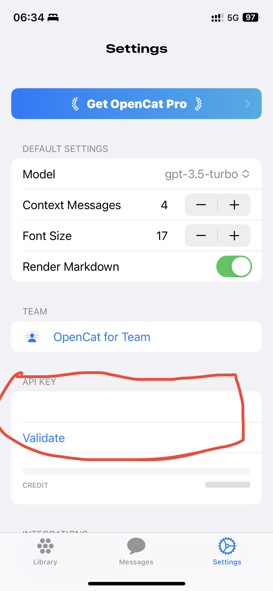
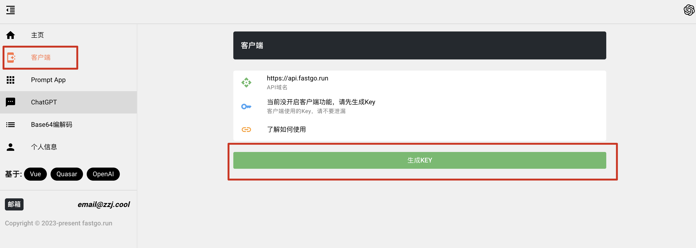
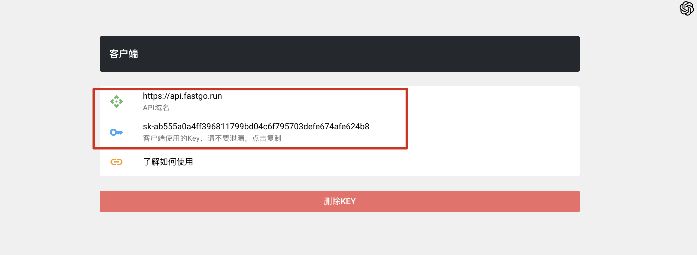
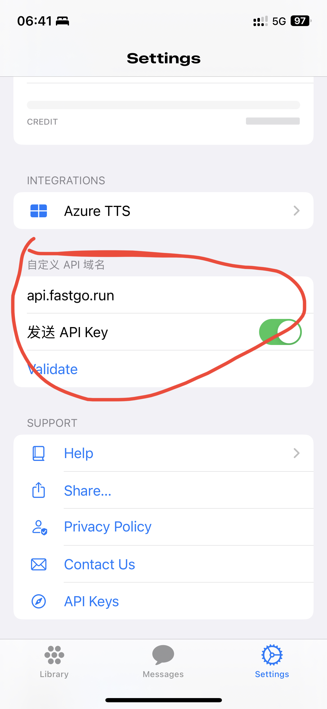

# ChatGPT 客户端

OpenAI 的 ChatGPT 有两种方式使用，分别是网页版，也就是 chat.openai.com，以及 API，前者已经屏蔽了亚洲区域，并且大型 IDC 的梯子也都上不去，所以使用 API 的方式更为便捷。
这里介绍一下常见的客户端。

- IOS
  - [OpenCat](https://apps.apple.com/app/id6445999201)
- Android
- MacOS
  - [OpenCat](https://apps.apple.com/app/id6445999201)
- Windows
- Web

## OpenCat 使用

1. 下载 APP [OpenCat](https://apps.apple.com/app/id6445999201)
2. 打开 APP，点击右下角 Settings 按钮，输入 API Key

   

3. 点击校验没问题即可使用

## 使用代理

如果没有OpenAI的账号或者IP被墙，可以使用[FastGo](https://fastgo.run)，提供的中转功能

1. 打开左侧客户端

   

2. 点击生成Key

   

3. 复制自己的key

4. 在客户端中输入自己的Key

5. 客户端中自定义API域名，以OpenCat为例，输入`api.fastgo.run`

   

