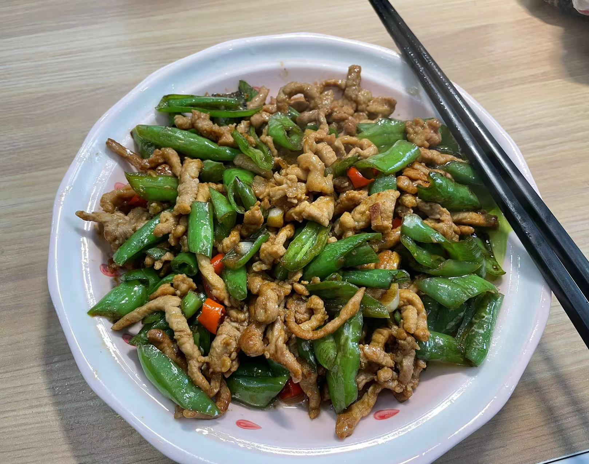

## 材料准备

* 主料
  * 辣椒
  * 猪肉
* 辅料
  * 小米椒
  * 玉米淀粉
  * 油
  * 糖
  * 盐
  * 生抽
  * 老抽
  * 鸡精
  * 大蒜

## 准备工作

1. 将猪肉切成丝，加入少量老抽和生抽，玉米淀粉腌制，使用淀粉腌制过的猪肉会更加的嫩，腌制十分钟左右就可以。
2. 辣椒切开，掏出辣椒籽，放一旁备用，根据自己喜好可以加入适量来额小米椒。
3. 大蒜切粒。

## 制作流程

1. 热锅，加入食用油，等待油热。
2. 将腌制的猪肉倒入锅中，大火翻炒，炒至变色后关火。
3. 将肉倒出，放一旁备用。
4. 剩下的油继续开火，放入大蒜。
5. 等待有香味后加入辣椒翻炒。
6. 炒一会后倒入之前的肉，加少量的糖。
7. 加入适量的鸡精、盐、生抽以及少量老抽提色。
8. 翻炒后出锅

## 成品总结

第一次炒，肉放的太多了（主要还是盒马上买的一份辣椒份量实在是太少了），然后上海这里的辣椒都不是很辣，即使加入了小米椒，辣度还是有限。

总体来说味道还是很不错的，从小最喜欢的一道菜。
