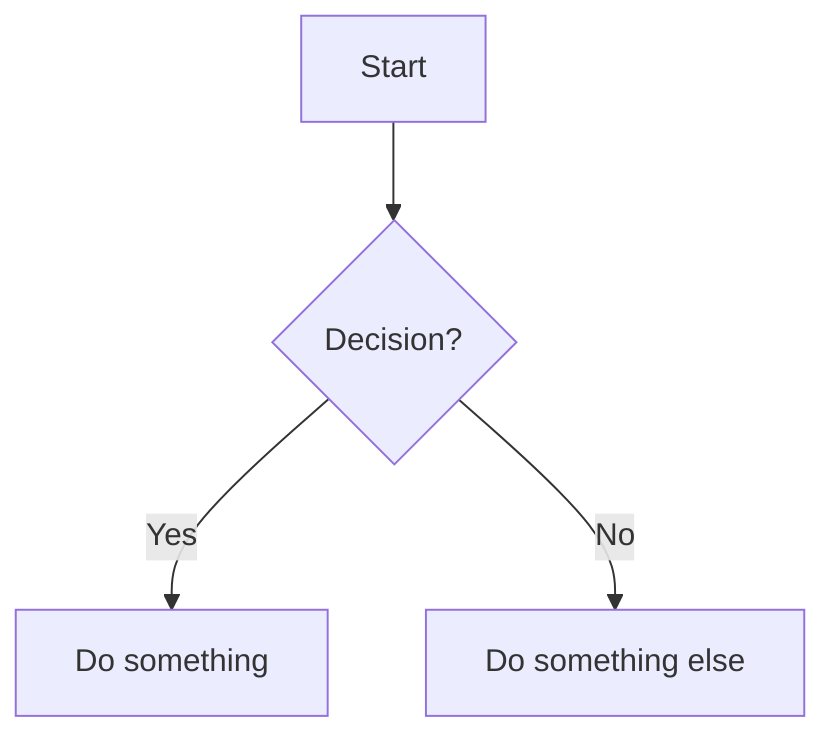
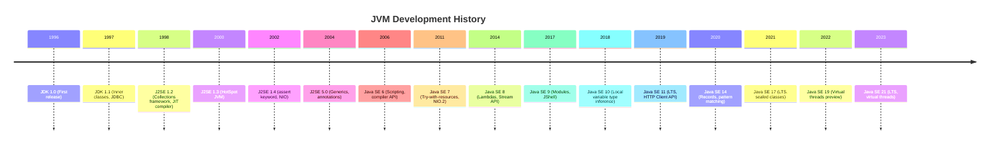

# 深入理解JAVA虚拟机：JVM高级特性与最佳实践

## 第一章：概述

## 第二章：Java内存区域与内存溢出异常

## 第三章：垃圾收集器与内存分配策略

## 第四章：虚拟机性能监控与故障处理工具

## 第五章：调优案例分析与实战

```mermaid
graph TD
    A[Start] --> B{Decision?}
    B -->|Yes| C[Do something]
    B -->|No| D[Do something else]
```

## JVM发展历史

```mermaid
timeline
    title JVM Development History
    1996 : JDK 1.0 (First release)
    1997 : JDK 1.1 (Inner classes, JDBC)
    1998 : J2SE 1.2 (Collections framework, JIT compiler)
    2000 : J2SE 1.3 (HotSpot JVM)
    2002 : J2SE 1.4 (assert keyword, NIO)
    2004 : J2SE 5.0 (Generics, annotations)
    2006 : Java SE 6 (Scripting, compiler API)
    2011 : Java SE 7 (Try-with-resources, NIO.2)
    2014 : Java SE 8 (Lambdas, Stream API)
    2017 : Java SE 9 (Modules, JShell)
    2018 : Java SE 10 (Local variable type inference)
    2019 : Java SE 11 (LTS, HTTP Client API)
    2020 : Java SE 14 (Records, pattern matching)
    2021 : Java SE 17 (LTS, sealed classes)
    2022 : Java SE 19 (Virtual threads preview)
    2023 : Java SE 21 (LTS, virtual threads)
```
