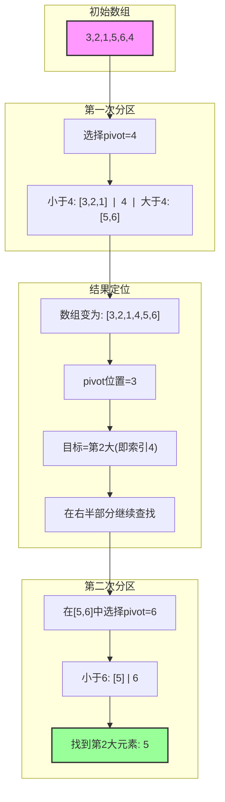
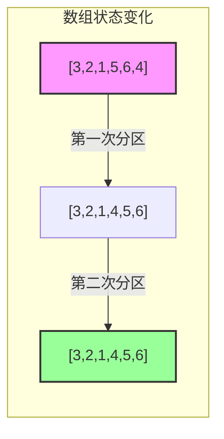
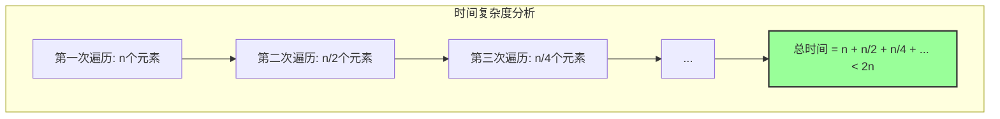

## 题目描述

给定整数数组 nums 和整数 k，请返回数组中第 k 个最大的元素。

请注意，你需要找的是数组排序后的第 k 个最大的元素，而不是第 k 个不同的元素。

你必须设计并实现时间复杂度为 O(n) 的算法解决此问题。

## 解题思路

这道题最优解法是使用快速选择算法（Quick Select），它是快速排序的变体。主要思路如下：

1. 使用快速选择算法，每次选择一个基准值（pivot）
2. 将数组分为大于基准值和小于基准值的两部分
3. 根据基准值的位置，判断第k大的元素在哪一部分，只递归搜索那一部分
4. 重复以上步骤直到找到第k大的元素

时间复杂度分析：
- 平均时间复杂度：O(n)
- 最坏时间复杂度：O(n²)
- 空间复杂度：O(1)

## 图解示例

让我们通过一个具体的例子来说明快速选择算法的工作过程。以查找第2大元素为例：



### 算法步骤说明

1. **初始状态**：数组为[3,2,1,5,6,4]，要找第2大的元素
2. **第一次分区**：
   - 选择4作为基准值（pivot）
   - 将数组分为小于4的部分[3,2,1]和大于4的部分[5,6]
   - 4的位置在索引3，而我们需要找的是索引4（倒数第2个位置）
   - 因此需要在右半部分[5,6]中继续查找
3. **第二次分区**：
   - 在[5,6]中选择6作为基准值
   - 分区后得到[5]和[6]
   - 5正好在倒数第2个位置，即为所求



### 为什么是O(n)时间复杂度？



每次分区操作都会将问题规模减半，并且我们只需要处理其中的一半。这形成了等比数列：
- T(n) = n + n/2 + n/4 + n/8 + ...
- 这个级数的和小于2n
- 因此时间复杂度为O(n)

## 代码实现

```go
func findKthLargest(nums []int, k int) int {
    // 将第k大转换为第n-k+1小，这样更容易理解
    k = len(nums) - k
    return quickSelect(nums, 0, len(nums)-1, k)
}

func quickSelect(nums []int, left, right, k int) int {
    if left == right {
        return nums[left]
    }
    
    // 选择基准值的位置
    pivotIndex := partition(nums, left, right)
    
    if pivotIndex == k {
        return nums[k]
    } else if pivotIndex < k {
        return quickSelect(nums, pivotIndex+1, right, k)
    }
    return quickSelect(nums, left, pivotIndex-1, k)
}

func partition(nums []int, left, right int) int {
    // 选择最右边的元素作为基准值
    pivot := nums[right]
    i := left
    
    for j := left; j < right; j++ {
        if nums[j] <= pivot {
            nums[i], nums[j] = nums[j], nums[i]
            i++
        }
    }
    
    nums[i], nums[right] = nums[right], nums[i]
    return i
}
```

## 复杂度分析

- 时间复杂度：O(n)
  - 虽然最坏情况下是O(n²)，但平均时间复杂度是O(n)
  - 这是因为每次partition后，我们只需要递归处理一半的数据

- 空间复杂度：O(1)
  - 原地排序，只需要常数级别的额外空间

## 示例

```go
输入: nums = [3,2,1,5,6,4], k = 2
输出: 5
解释: 数组排序后为 [1,2,3,4,5,6]，第2大的元素是5
```

## 注意事项

1. 这个解法会修改原数组，如果不想修改原数组，需要先复制一份
2. 为了优化最坏情况，可以随机选择基准值
3. 如果数组中有大量重复元素，可以使用三路快排的思想进行优化